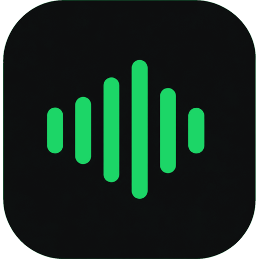
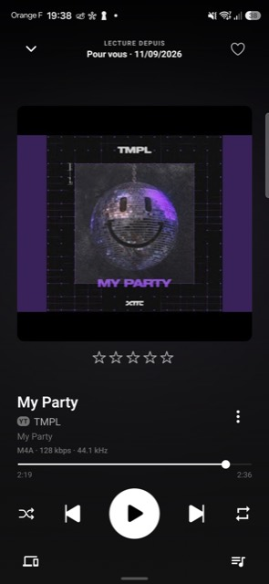
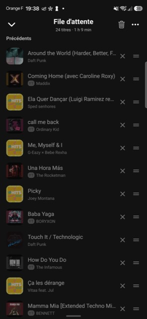
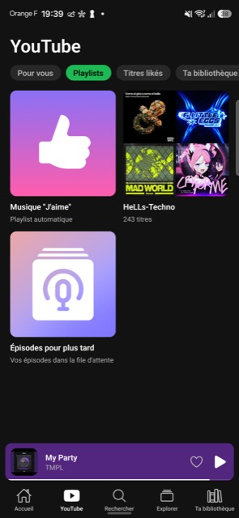
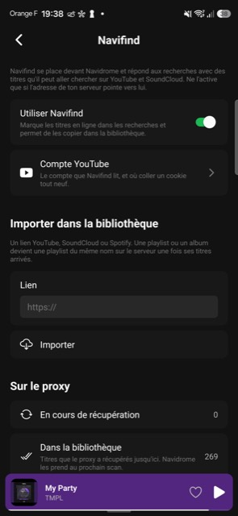
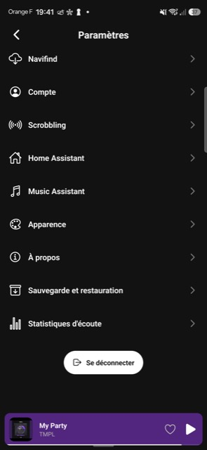

  

<h1 align="center">Resonuls</h1>

  A clean music player for your self-hosted server, and your local files.
   
  Android, with an experimental iOS build.

  <em>A fork of <a href="https://github.com/juananzzz/resonus">Resonus</a> by
  <a href="https://github.com/juananzzz">juananzzz</a>, with everything below
  added on top.</em>

---

  
  

## Screenshots

| Home | Player | Queue |
| :---: | :---: | :---: |
|  |  |  |

| YouTube | Navifind | Settings |
| :---: | :---: | :---: |
|  |  |  |

## What this fork adds

Everything Resonus does, plus:

### Navifind and YouTube Music

**What Navifind is.** A small companion server of mine that sits between the
app and Navidrome. Everything it does not recognise it passes straight through,
so to the app it is an ordinary Subsonic server; what it adds is answering a
search with tracks that are not in the library yet, and keeping a YouTube Music
session so the app can show what that account is given. It is a separate
project, it is not published here, and I would rather be asked than post it: if
it is of use to you, get in touch through this repository.

The app works perfectly well without it. Every feature below simply does not
appear when it is switched off.

- **Navifind support**: with the proxy in
  front of Navidrome, a search also answers with tracks it can fetch from
  YouTube and SoundCloud. They are badged as such, play straight away, and the
  proxy files them into the library by itself after ten seconds of listening.
- **Import from a link**: paste a YouTube, SoundCloud or Spotify address and a
  playlist or album becomes a playlist of the same name on the server once its
  tracks have arrived. A notification says when the proxy has finished.
- **A YouTube tab**: the shelves of the YouTube Music home page your account is
  shown, your playlists, the tracks you liked and the records you keep. It
  starts off and is offered only where Navifind is on.
- **Signing in from the phone**: one button opens Google's own sign-in page
  inside the app, and the session it leaves behind goes to the proxy by itself.
  Two-factor, passkeys and account recovery all behave as they do anywhere
  else, and no password passes through the app. Pasting a browser's `Cookie`
  header still works underneath, as the way out.

### A mix built from what you listen to

- **"For you"**: one press and it plays music drawn from three places at once —
  what the library answers for the artists and genres you play most, your
  favorites, and what YouTube Music picks for your account. They are woven
  rather than laid end to end, what you heard in the last three hours is left
  out, and a song your server and YouTube both have is taken once.
- It leaves a dated playlist behind. The library's songs go in immediately and
  each YouTube track joins as the proxy finishes fetching it, so the music
  starts at once rather than waiting on the playlist.

### More outputs

- **Home Assistant**: the media players it knows, Chromecast, DLNA and Sonos
  among them, appear in the Output sheet. One speaker is often several entities
  there, so they are kept one per name, and the one that can wake a speaker in
  standby is remembered and asked first.
- **Music Assistant**, spoken to directly rather than through Home Assistant.
  Nothing is polled, and no address is handed to a speaker: a song is named by
  its id in the library Music Assistant already keeps, and it fetches the song
  itself. So a server behind custom headers casts like any other, and the phone
  does not have to stay awake for the music to go on.

### Android Auto

- **Search reaches the whole library**, not only the browse tree the phone had
  pushed, so a record nobody has played lately is found by typing its name.
  Results come grouped under Songs, Albums and Artists.
- **Keep a song as a favorite from the playback screen**, which until now meant
  picking up the phone.
- **The car says when a song will not play.** A server going out of reach used
  to stop the music and leave the screen saying nothing.
- **The browser explains itself when there is nothing to show** — no account on
  this phone, or offline with nothing downloaded — rather than offering empty
  tabs. A row that resumes a song carries how far through it already is.
- **The car, the widget and another app's broadcast start the app themselves**,
  with no screen and nothing brought to the front. A song tapped on the car's
  screen with the phone asleep in a pocket used to be handed to nobody.

### Lists

- **More ways to sort a song list**: the date added, the year, the length, the
  play count and the rating, either way round. A song the server says nothing
  about goes to the end whichever way the list runs.
- **A quick filter** narrows a list to the downloaded songs or the favorites
  for as long as you are looking at it, with a line across the top saying how
  much it is hiding.
- Both reach albums, playlists, smart playlists, an artist's songs, the
  favorites and the bookmarks.

### Elsewhere

- Custom HTTP headers reach casting, DLNA and the car: a server behind them is
  relayed through the phone rather than handed out as an address.
- The update check looks at this fork's own releases.
- French translation.

## Download

Get the latest APK from the [Releases](https://github.com/HeLLsSs/resonus/releases/latest)
page, or add the repository to
[Obtainium](https://apps.obtainium.imranr.dev/redirect?r=obtainium://add/https://github.com/HeLLsSs/resonus)
for automatic updates. The app also checks for a newer release by itself and
can download and install it; the switch is under Settings › About.

## Features

Everything the upstream project does:

- **Navidrome / OpenSubsonic / Jellyfin / Ampache**: multi-profile login, multi-library support, plus several server addresses with automatic switching
- **Local mode**: play music straight from your device or a folder, no server needed
- **Offline mode**: your favorites, playlists and albums stay browsable with no connection; downloaded songs play, the rest show grayed out, and it switches automatically when the server is unreachable
- **Downloads**: albums, playlists, an artist's whole discography or single songs, in original quality or transcoded
- **Synced lyrics**: karaoke view with tap-to-seek, full-screen mode, optional LRCLIB lookup
- **Internet radio**: browse and manage your stations
- **Cast to speakers**: UPnP/DLNA renderers and Sonos, with room grouping; local music streams to them too
- **Playback**: gapless, crossfade, built-in equalizer, ReplayGain normalization, playback speed, sleep timer, queue with undo, shuffle, repeat, background & lock-screen controls
- **Autoplay & mixes**: keep the music going with similar songs, or start a mix from any track
- **Organize**: multi-select (queue, playlist or download in batch), star ratings, pinned items, play history
- **Themes**: dark, light (experimental) or whichever one the phone is on, each with its own accent color
- **Make it yours**: reorder and show/hide Home sections and explore chips, app fonts, configurable swipe and ⋯ menu actions
- **Landscape and tablet layouts**
- **Queue sync across devices**
- **In 9 languages**: English, Spanish, German, Catalan, Russian, Italian, Simplified Chinese, Ukrainian, French

## FAQ

The questions that come up most often are answered in
[docs/FAQ.md](./docs/FAQ.md), starting with how to get the app to show up in
Android Auto. Controlling it from other apps is documented in
[docs/INTENTS.md](./docs/INTENTS.md).

## Credits

Resonuls is a fork of [Resonus](https://github.com/juananzzz/resonus), which is
where almost all of this comes from. If you enjoy the app, the person to thank
is [juananzzz](https://github.com/juananzzz) — there is a
[Ko-fi](https://ko-fi.com/juananzzz) and a
[Discord](https://discord.gg/pecE8MTPVr) for the upstream project.

Thanks to the people who have translated the app:

| Language | Contributor(s) |
| --- | --- |
| English | [juananzzz](https://github.com/juananzzz) |
| Español | [juananzzz](https://github.com/juananzzz) |
| Deutsch | [Psychotoxical](https://github.com/Psychotoxical), [CraftoHohenvels](https://github.com/CraftoHohenvels) |
| Català | [juananzzz](https://github.com/juananzzz) |
| Русский | [ztx-lyghters](https://github.com/ztx-lyghters) |
| Italiano | [Anakin-bb8](https://github.com/Anakin-bb8) |
| 简体中文 | [xcdmrCHP](https://github.com/xcdmrCHP) |
| Українська | [albedych](https://github.com/albedych) |
| Français | Gaëtan |

## Contributing

See [CONTRIBUTING.md](./CONTRIBUTING.md) for how to set up the project, run it
on an emulator, and open a pull request. Changes that are not specific to this
fork are worth sending upstream.
